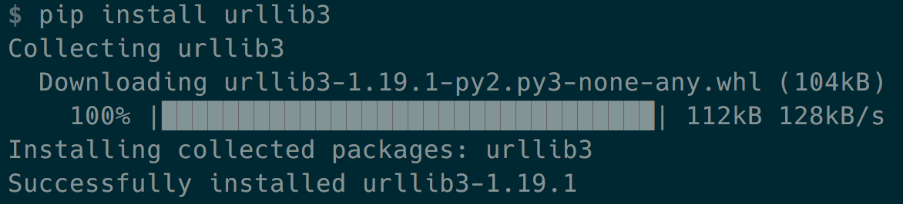
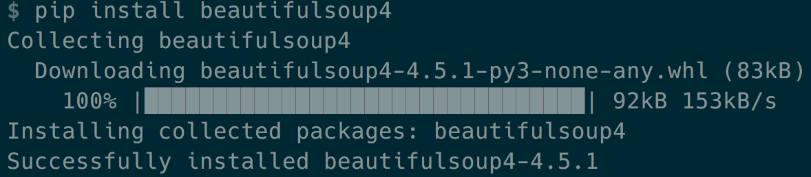
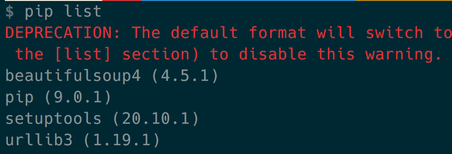
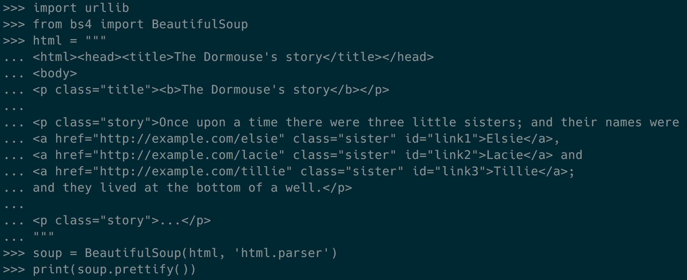
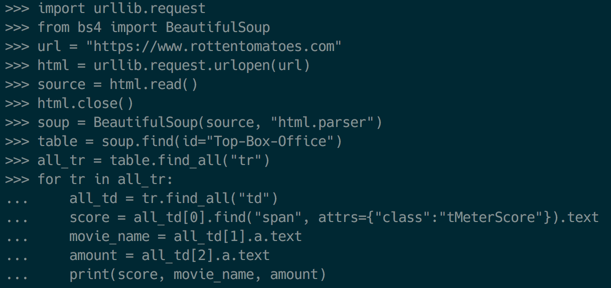
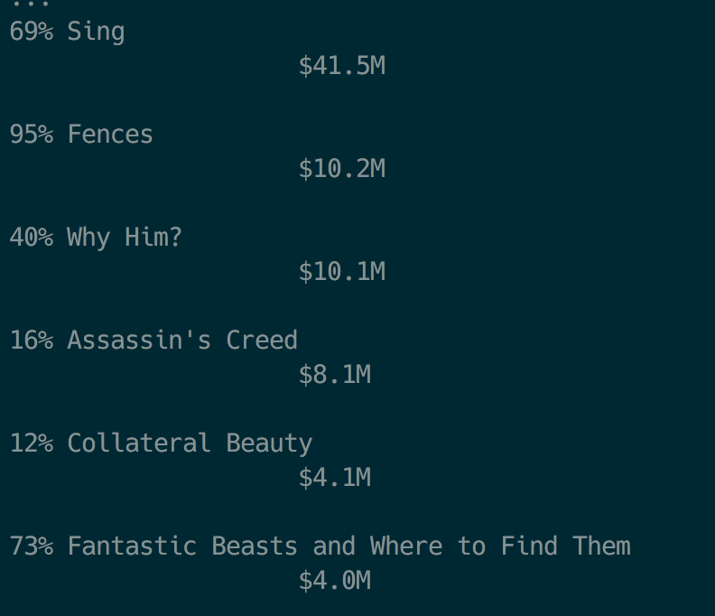

# Fastcampus 
## Web Programming SCHOOL
### Python Basic
2017.1.3

---
<!-- page_number:true -->

## Review
- Python basic
	- `List`, `Tuple`, `Dictionary`
	- Loop(`for`, `while`)
	- Function
	- Class

---
## Network

---
## Network
A computer network or data network is a telecommunications network which allows nodes to share resources.

--> 컴퓨터간 리소스를 공유 가능하게 만드는 통신망

---
## Charcteristics of Network
- 컴퓨터사이의 리소스를 공유
- 네트워크로 연결된 다른 컴퓨터에 접근하여 파일을 생성, 수정, 삭제할 수 있음
- 프린터와 스캐너, 팩스 등의 출력장치에 네트워크를 연결하여 여러 컴퓨터가 동시 접근 가능

---
## Requirements of Network
- Network Cable
- Distributor(Switch Hub)
- Router
- Network card

---
## intranet vs Internet vs internet
- intranet: internet의 www기술을 활용하여 특정 단체의 내부 정보시스템을 구축하는 것 혹은 그 네트워크
- Internet(`International Network`): TCP/IP를 활용하여 정보를 주고 받는 통신 네트워크(www)
- internet(`internetwork`): 패킷을 교환하는 방식으로 기기간의 정보를 주고 받는 방식

---
## BUT!! AP가 Internet을 internet으로 표현하는 style guide를 발표!!

- `e-mail` --> `email`
- `Web site` --> `website`


---
## Network OSI 7 layer

- `O`pen `S`ystems `I`nterconnection Reference Model
- 국제 표준화기구에서 개발한 컴퓨터 네트워크 프로토콜 디자인과 통신을 계층으로 나누어 설명한 것

---
## Network OSI 7 layer


---
## Network OSI 7 layer


---
## Network OSI 7 layer


---
## HTTP
HyperText Transfer Protocol

- www상에서 정보를 주고받는 프로토콜
- TCP, UDP를 활용함
- HTTP method: GET, POST, PUT, DELETE

---
## FTP
File Transfer Protocol
- 서버와 클라이언트 사이에 파일전송을 위한 프로토콜
- but, 보안에 매우 취약(패킷 가로채기, 무차별 대입, ...)
- 현재는 FTPS(FTP-SSL), SFTP(simple FTP), SSH(Secure SHell) 등을 사용

---
## SMTP
Simple Mail Transfer Protocol
- Internet에서 메일을 보내기 위한 프로토콜

---
## TCP/IP
Transmission Control Protocol / Internet Protocol
- 전송제어 프로토콜 + 송수신 호스트의 패킷교환을 위한 프로토콜

---
## UDP
User(Universal) Datagram Protocol
- 데이터그램을 전송하기 위한 프로토콜
- 메시지 수신확인x, 도착순서 예측x
- 빠른 속도, 적은 오버헤드

---
## TCP vs UDP segment


---
## Web Programming

---
### Web architecture


---
### 웹 개발 패턴의 변화

- 1991 ~ 1999: Sir Timothy John "Tim" Berners-Lee가 하이퍼텍스트 기반의 프로젝트를 제안한 이후 정적인 컨텐츠들을 중심으로 한 웹 기술이 발달
- 1999 ~ 2009: Linux, Apache, Mysql, Php 중심의 동적인 서버, 정적인 클라이언트 모델이 지속됨
- 2010 ~ 현재: Javascript!! (Dynamic Web Client)

---
## URI, URL, URN

### URI 
- Uniform Resource Information
- `https://www.example.com/post/how-to-make-url`
### URL 
- Uniform Resource Locator
- `https://www.example.com/post/`

### URN 
- Uniform Resource Name
- `www.example.com/post/how-to-make-url`

---
## REST API
`RE`presentational `S`tate `T`ransfer 
`A`pplication `P`rogramming `I`nterface

`Resource` - URI
`Verb` - HTTP method
`Representations` - 표현

---
## CRUD

### Create
### Read
### Update
### Delete

---
#### REST API 설계시 주의할 점

- 버전관리 https://api.foo.com/v1/bar
- 명사형 사용 https://foo.com/showid/ --> https://foo.com/user/
- 반응형 https://foo.com/m/user/, https://m.foo.com/user/ (x)
- 언어코드 https://foo.com/kr/, https://kr.foo.com/ (x)
- 응답상태 코드 (200, 400, 500)

---
## HTTP Response code

[wikipedia](https://en.wikipedia.org/wiki/List_of_HTTP_status_codes)

200, 201 - Success
400, 404 - Not found
500 - Server error

---


---
## Database


---
## SQL(Structured Query Language)

데이터 관리를 위해 설계된 특수 목적의 프로그래밍 언어


---
## SQL - 데이터 정의언어
데이터를 정의

CREATE - DB 개체 정의
DROP - DB 개체 삭제
ALTER - DB 개체 정의 변경

---
## SQL - 데이터 조작언어
데이터 검색, 등록, 삭제, 갱신

INSERT - 행, 테이블 데이터 삽입
UPDATE - 테이블 업데이트
DELETE - 특정 행 삭제
SELECT - 테이블 검색 결과 집합

---
## SQL - 데이터 제어언어
데이터 액세스 제어

GRANT - 작업 수행권한 부여
REVOKE - 권한 박탈

---
## RDB vs NoSQL
|구분|RDB|NoSQL|
|:--:|:--:|:--:|
|형태|Table|Key-value, Document, Column|
|데이터|정형 데이터|비정형 데이터|
|성능|대용량 처리시 저하|잦은 수정시 저하|
|스키마|고정|Schemeless|
|유명|Mysql, MariaDB, PostgreSQL|MongoDB, CouchDB, Redis, Cassandra |

---
## RDB
[PostgreSQL Docs](https://www.postgresql.org/docs/9.1/static/ddl-basics.html)
|name| age|
|:--:|:--:|
|John|  17|
|Mary|  21|

```python
rdb = 
{
	name:[John, Mary],
	age:[17, 21]
}
```

---
## NoSQL
[MongoDB Docs](https://docs.mongodb.com/manual/core/document/)
```python
nosql = 
[
	{
		name:John, 
		age:17
	},
	{
		name:Mary, 
		age:21
	},

	...
]
```

---
## Document vs Key-value
```
document
{
	key: value,
	key: {
		key: value,
		key: value
		}
}
```

```
key-value
{
	key: value,
	key: value,
	key: value
}
```

---
## Web Crawling with Python


---
## Scraping vs Crawling vs Parsing

Scraping: 데이터를 수집하는 행위


---
## Scraping vs Crawling vs Parsing
 
Crawling: 조직적 자동화된 방법으로 월드 와이드 웹을 탐색하는 것


---
## Scraping vs Crawling vs Parsing

Parsing: 문장 혹은 문서를 구성 성분으로 분해하고 위계관계를 분석하여 문장의 구조를 결정하는 것


---
## Beautiful Soup

---
## Crawling with Beautiful Soup

`$ pip install urllib3`


`$ pip install beautifulsoup4`


---
## Crawling with Beautiful Soup


---
## Crawling with Beautiful Soup


---
## Crawling with Beautiful Soup

```
import urllib
from bs4 import BeautifulSoup
html = """

uglified html code

"""
soup = BeautifulSoup(html, "html.parser")
print(soup.prettify())
```


---
## Crawling with Beautiful Soup
```
curl https://www.rottentomatoes.com
```

```python
import urllib.request
from bs4 import BeautifulSoup


url = "https://www.rottentomatoes.com"
html = urllib.request.urlopen(url)
source = html.read()
html.close()

soup = BeautifulSoup(source, "html.parser")
print(soup)

table = soup.find(id="Top-Box-Office")
print(table)
```

---
## Crawling with Beautiful Soup

```python
all_tr = table.find_all("tr")

for tr in all_tr:
     all_td = tr.find_all("td")
     score = all_td[0].find("span", attrs={"class":"tMeterScore"}).text
     movie_name = all_td[1].a.text
     amount = all_td[2].a.text
     print(score, movie_name, amount)
```


---
## Crawling with Beautiful Soup



---
## Crawling with Beautiful Soup

